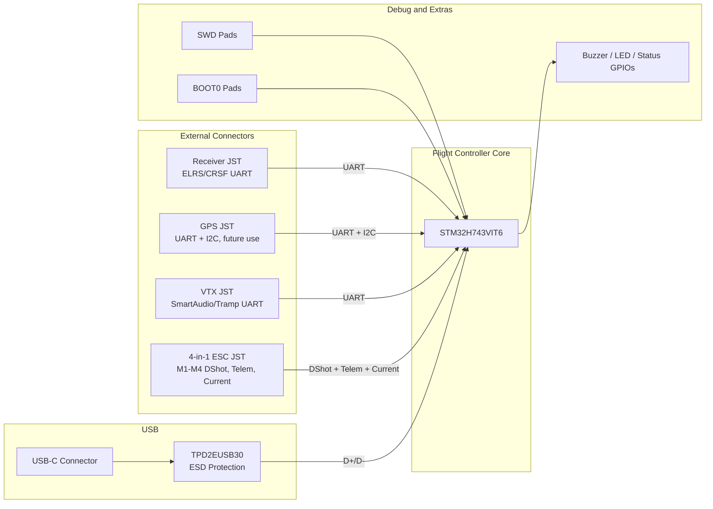
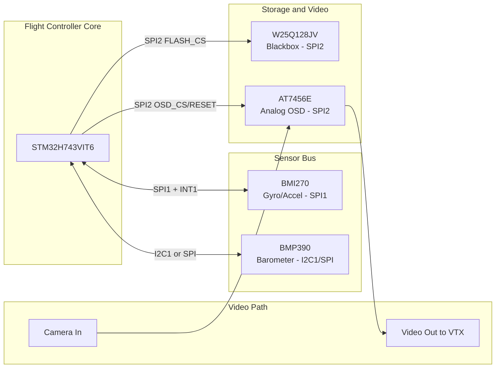
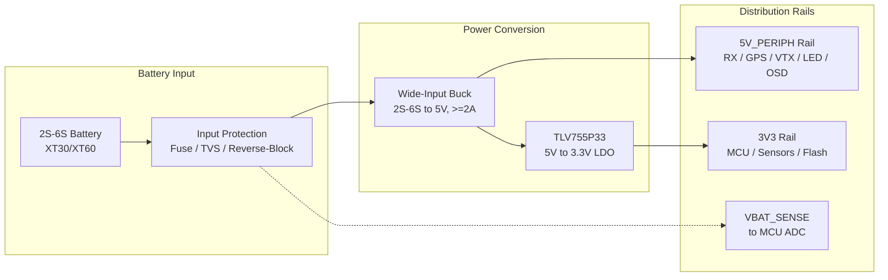

# Flight Controller Complete System Diagram

Selected parts:

- MCU: STM32H743VIT6
- IMU: Bosch BMI270
- Barometer: Bosch BMP390
- Blackbox flash: Winbond W25Q128JV
- Analog OSD: AT7456E
- 3.3V LDO: TLV755P33
- USB ESD: TPD2EUSB30
- No onboard magnetometer
- No onboard GNSS module
- Onboard 2S-6S battery buck regulator added for direct battery connection

## Complete Labeled System Diagram

## Connection Table

| Source | Destination | Connection | Purpose |
|---|---|---|---|
| Battery / ESC VBAT | Input protection | `VBAT_RAW`, `GND` | Main board power input for direct battery operation. |
| Input protection | 5V buck | protected `VBAT` | Converts 2S-6S battery voltage to board 5V. |
| Input protection | STM32 ADC | resistor-divided `VBAT_SENSE` plus RC filter | Battery voltage measurement. |
| 5V buck | TLV755P33 | `5V_FC`, `GND` | Feeds the 3.3V regulator. |
| 5V buck | Receiver/GPS/VTX/LED/OSD rails | `5V_PERIPH`, `GND` | Powers 5V peripherals and analog OSD. |
| TLV755P33 | STM32H743VIT6 | `3V3`, `GND` | MCU core I/O supply rail. |
| TLV755P33 | BMI270/BMP390/W25Q128JV | `3V3`, `GND` | Clean sensor and flash supply rail. |
| STM32H743VIT6 | BMI270 | `SPI1_SCK`, `SPI1_MISO`, `SPI1_MOSI`, `BMI_CS` | Fast gyro/accelerometer data bus. |
| BMI270 | STM32H743VIT6 | `BMI_INT1` | Data-ready interrupt for deterministic gyro sampling. |
| STM32H743VIT6 | BMP390 | `I2C1_SCL`, `I2C1_SDA` or SPI bus | Barometer pressure/temperature data. |
| BMP390 | STM32H743VIT6 | optional `BMP_INT` | Optional pressure data interrupt. |
| STM32H743VIT6 | W25Q128JV | `SPI2_SCK`, `SPI2_MISO`, `SPI2_MOSI`, `FLASH_CS` | Blackbox log storage. |
| STM32H743VIT6 | AT7456E | `SPI2_SCK`, `SPI2_MISO`, `SPI2_MOSI`, `OSD_CS`, `OSD_RESET` | OSD configuration and character data. |
| Camera JST | AT7456E | `VIDEO_IN`, `GND` | Analog camera video enters OSD. |
| AT7456E | VTX JST | `VIDEO_OUT`, `GND` | Video with OSD overlay goes to transmitter. |
| USB-C | TPD2EUSB30 | `D+`, `D-` | ESD protection at the connector. |
| TPD2EUSB30 | STM32H743VIT6 | `USB_DP`, `USB_DM` | USB configurator and DFU data lines. |
| USB-C | STM32H743VIT6 | `VBUS_SENSE` | Lets firmware detect USB presence. |
| USB-C | GND | `CC1` and `CC2` through 5.1k resistors | USB-C device-mode advertisement. |
| STM32H743VIT6 | ESC JST | `M1`, `M2`, `M3`, `M4` | DShot motor control signals. |
| ESC JST | STM32H743VIT6 | `ESC_TELEM` UART RX | ESC telemetry/RPM data. |
| ESC JST | STM32 ADC | `CURRENT` through RC filter | Current measurement from ESC sensor output. |
| Receiver JST | STM32H743VIT6 | UART TX/RX | ELRS/CRSF receiver control link. |
| GPS JST | STM32H743VIT6 | UART TX/RX | Future external GPS module support. |
| GPS JST | STM32H743VIT6 | `I2C_SCL`, `I2C_SDA` | Optional external I2C sensor/compass lines, no onboard magnetometer. |
| VTX JST | STM32H743VIT6 | UART TX/RX | SmartAudio, Tramp, or MSP VTX control. |
| STM32H743VIT6 | Buzzer MOSFET | GPIO | Low-side switched buzzer output. |
| STM32H743VIT6 | WS2812 LED pad | GPIO data | Addressable LED control. |
| STM32H743VIT6 | Status LEDs | GPIOs | Power/firmware status indication. |
| BOOT0 button | STM32H743VIT6 | `BOOT0` | Force ROM bootloader / DFU recovery. |
| SWD pads | STM32H743VIT6 | `SWDIO`, `SWCLK`, `NRST`, `3V3`, `GND` | Programming and debug access. |

## Power Architecture Notes

- Add the buck because direct battery connection is now part of the design.
- Without the buck, the FC would need a regulated 5V BEC from the ESC.
- The buck should accept full 6S voltage plus transient margin. Use a wide-input design, not a marginal 17V regulator.
- A practical first-revision target is a 5V buck rated for at least 2A if powering receiver, GPS connector, LEDs, OSD, and light VTX/control loads.
- Keep high-current VTX power optional or separately filtered. Many VTX modules are happier from VBAT or their own regulator than from a tiny FC buck.
- `TLV755P33` remains the local 3.3V regulator after the buck. Do not connect battery voltage directly to it.

