# Custom Hobby Drone Flight Controller PCB Requirements

Version: 1.0  
Date: 2026-07-05  
Target: 5-inch hobby quadcopter, Betaflight/INAV, separate 4-in-1 ESC  
Status: Planning and requirements document for schematic/PCB design

## 1. Executive Summary

This document defines the requirements for a compact hobby flight controller PCB for a 5-inch FPV quadcopter. The board is intended to run Betaflight or INAV and connect to a separate 4-in-1 ESC. It should support modern receiver and video systems, blackbox logging, battery/current sensing, GPS expansion, and staged bench and flight validation.

The selected baseline is:

- 36 x 36 mm PCB with 30.5 x 30.5 mm M3 mounting holes.
- STM32H743VIT6 MCU for firmware headroom and future-proofing.
- BMI270 SPI IMU near board center, with clean power and short traces.
- BMP390 barometer on I2C or SPI.
- W25Q128JV SPI NOR flash for Blackbox.
- AT7456E analog OSD for camera-to-VTX video overlay.
- USB-C device port with TPD2EUSB30 ESD protection and DFU/boot access.
- UARTs for ELRS/CRSF receiver, VTX control, GPS connector expansion, ESC telemetry, and spare/debug.
- VBAT and current ADC sensing, using current signal from ESC or external power module.
- 2S-6S capable onboard buck regulator for direct battery input, plus TLV755P33 quiet 3.3V LDO rail.
- Buzzer, WS2812 LED pad, status LEDs, boot button, SWD pads.
- No onboard magnetometer and no onboard GNSS. GPS is connector-only for future external module support.

This is not a certified aviation product. It should be treated as an experimental hobby design and validated with conservative electrical, firmware, and flight testing.

## 2. Requirement Levels

| Level | Meaning |
|---|---|
| MUST | Required for the baseline flight controller. |
| SHOULD | Strongly recommended for a useful and robust board. |
| OPTIONAL | Add only if the target build needs the feature. |
| EXCLUDE | Do not include in the baseline because it adds complexity or risk. |

## 3. Target Applications

| Application | Feature Set |
|---|---|
| Racing/freestyle 5-inch quad | H7 or F7 MCU, single SPI IMU, blackbox flash, ELRS/CRSF UART, HD VTX UART, 4 motor outputs, no required barometer or magnetometer. |
| Long-range INAV quad | Add GPS UART, barometer, I2C external compass connector, larger blackbox flash, strong buzzer, robust 5V rail. |
| Analog FPV quad | Add analog OSD, video input/output filtering, camera and VTX power pads. |
| Autonomous/camera rig | Prefer an ArduPilot/PX4-style board with redundancy, CAN, GNSS/compass, richer power monitoring, and more UARTs. This is outside baseline scope. |
| Sub-250g/micro quad | Use a smaller board, reduce connectors, omit analog OSD/barometer unless needed. This is outside baseline scope. |

## 4. System Architecture

```mermaid
flowchart TB
    BAT["2S-6S Battery / XT30-XT60 / ESC VBAT"] -- "VBAT_RAW and GND" --> INPROT["Input Protection\nFuse/TVS/reverse-protection option"]
    INPROT -- "Protected VBAT for power conversion" --> BUCK["2S-6S to 5V Buck Regulator\nwide-input, >=2A recommended"]
    INPROT -- "VBAT_SENSE through resistor divider + RC filter" --> MCU_ADC["STM32H743VIT6 ADC pins"]
    BUCK -- "5V_FC rail" --> LDO["TLV755P33\n5V to 3.3V LDO"]
    BUCK -- "5V_PERIPH rail" --> RXJST["4-pin Receiver JST\n5V, GND, UART_RX, UART_TX"]
    BUCK -- "5V_PERIPH or switched 5V" --> GPSJST["GPS JST connector only\n5V, GND, UART_TX, UART_RX, SCL, SDA"]
    BUCK -- "5V_PERIPH or VTX_5V" --> VTXJST["VTX JST\n5V, GND, VTX UART, VIDEO_OUT"]
    BUCK -- "5V analog/video supply with local filtering" --> OSD["AT7456E Analog OSD"]
    LDO -- "3V3 digital/sensor rail" --> MCU["STM32H743VIT6\nmain flight MCU"]
    LDO -- "3V3 sensor rail" --> BMI["BMI270\nSPI gyro/accelerometer"]
    LDO -- "3V3 sensor rail" --> BMP["BMP390\nbarometer"]
    LDO -- "3V3 flash rail" --> FLASH["W25Q128JV\nBlackbox flash"]

    MCU -- "SPI1 SCK/MISO/MOSI, BMI_CS" --> BMI
    BMI -- "BMI_INT1 data-ready interrupt" --> MCU
    MCU -- "I2C1 SCL/SDA or SPI CS/SCK/MISO/MOSI" --> BMP
    BMP -- "optional pressure data interrupt" --> MCU
    MCU -- "SPI2 SCK/MISO/MOSI, FLASH_CS" --> FLASH
    MCU -- "SPI2 SCK/MISO/MOSI, OSD_CS, OSD_RESET" --> OSD

    USB["USB-C device connector\nVBUS, D+, D-, CC1, CC2, GND"] -- "USB D+ and D- protected pair" --> ESD["TPD2EUSB30\nUSB ESD diode"]
    ESD -- "USB_DM and USB_DP" --> MCU
    USB -- "VBUS detect to MCU, CC1/CC2 5.1k pulldowns to GND" --> MCU

    ESCJST["4-in-1 ESC JST\nGND, VBAT, CURRENT, M1-M4, ESC_TELEM"] -- "DShot motor signals M1-M4" --> MCU
    ESCJST -- "ESC telemetry UART RX" --> MCU
    ESCJST -- "CURRENT analog signal through RC filter" --> MCU_ADC
    ESCJST -- "VBAT_RAW shared battery node" --> INPROT

    RXJST -- "CRSF/ELRS UART TX/RX" --> MCU
    GPSJST -- "future external GPS UART TX/RX" --> MCU
    GPSJST -- "optional external I2C SCL/SDA" --> MCU
    VTXJST -- "SmartAudio/Tramp/MSP UART TX/RX" --> MCU

    CAMJST["Camera JST\n5V/GND/VIDEO_IN"] -- "analog camera video input" --> OSD
    OSD -- "OSD-overlaid analog VIDEO_OUT" --> VTXJST

    MCU -- "low-side buzzer GPIO" --> BUZZ["Buzzer MOSFET + buzzer pads"]
    MCU -- "WS2812 data GPIO" --> LED["LED strip pad\n5V, GND, DATA"]
    MCU -- "status GPIOs" --> STATUS["Status LEDs"]
    BOOT["BOOT0 button / pads"] -- "force DFU boot mode" --> MCU
    SWD["SWD pads\n3V3, GND, SWDIO, SWCLK, NRST"] -- "programming and debug" --> MCU
```

## 5. Baseline Requirements

### 5.1 Flight Compute and Firmware

| ID | Level | Requirement |
|---|---|---|
| FC-COMP-001 | MUST | Use an STM32 MCU supported by Betaflight/INAV target infrastructure. |
| FC-COMP-002 | MUST | Provide USB DFU access and SWD debug/programming pads. |
| FC-COMP-003 | MUST | Provide enough timer-capable pins for 4 DShot motor outputs. |
| FC-COMP-004 | MUST | Provide at least 4 usable UARTs after USB, SPI, and debug allocation. |
| FC-COMP-005 | SHOULD | Use STM32H743VIT6 or STM32H743IIT6 as the baseline MCU. |
| FC-COMP-006 | OPTIONAL | Use STM32F722/F745/F765 if H7 cost, package, or availability is a concern. |
| FC-COMP-007 | EXCLUDE | Do not use RP2040/RP2350 for the baseline Betaflight/INAV board unless writing or porting firmware is in scope. |

Recommended baseline MCU: STM32H743VIT6. It gives generous flash/RAM, high clock rate, many serial interfaces, and enough headroom for future firmware features.

### 5.2 Motion Sensing

| ID | Level | Requirement |
|---|---|---|
| FC-IMU-001 | MUST | Include one 6-axis accelerometer/gyroscope IMU connected over SPI, not I2C. |
| FC-IMU-002 | MUST | Place the IMU close to the board center and align package axes with the flight controller axes. |
| FC-IMU-003 | MUST | Route IMU SPI lines short, with continuous ground reference and local decoupling. |
| FC-IMU-004 | SHOULD | Provide one dedicated interrupt/data-ready pin from IMU to MCU. |
| FC-IMU-005 | SHOULD | Keep regulators, USB connector stress, buzzer, and high-current pads away from the IMU. |
| FC-IMU-006 | OPTIONAL | Add a second IMU footprint or alternate IMU footprint if PCB area allows. |

Selected baseline IMU: Bosch BMI270. Good alternates: TDK ICM-42688-P, Bosch BMI323, TDK ICM-45686.

### 5.3 ESC and Motor Interface

| ID | Level | Requirement |
|---|---|---|
| FC-ESC-001 | MUST | Provide 4 motor signal outputs for a separate 4-in-1 ESC. |
| FC-ESC-002 | MUST | Route motor outputs on timer/DMA-capable MCU pins suitable for DShot. |
| FC-ESC-003 | MUST | Provide ESC telemetry UART RX pad. |
| FC-ESC-004 | MUST | Provide VBAT, current sense, ground, and 5V/logic connections expected by common ESC harnesses. |
| FC-ESC-005 | SHOULD | Use an 8-pin or 10-pin JST-SH ESC connector plus duplicate solder pads if board space allows. |
| FC-ESC-006 | EXCLUDE | Do not integrate MOSFETs or motor phase routing in the baseline FC-only design. |

Recommended connector target: JST-SH 1.0 mm pitch or clearly labeled solder pads compatible with common 4-in-1 ESC harnesses.

### 5.4 Receiver Interface

| ID | Level | Requirement |
|---|---|---|
| FC-RX-001 | MUST | Provide a dedicated full UART for ELRS/CRSF receiver: 5V, GND, TX, RX. |
| FC-RX-002 | SHOULD | Route receiver pads near a board edge for easy wiring. |
| FC-RX-003 | SHOULD | Provide SBUS-compatible labeling or inverter option if supporting legacy receivers. |
| FC-RX-004 | OPTIONAL | Add Spektrum/IBUS pad labels if desired. |

Recommended baseline: prioritize ELRS/CRSF full-duplex UART. Treat SBUS as legacy support.

### 5.5 FPV and Video

| ID | Level | Requirement |
|---|---|---|
| FC-FPV-001 | MUST | Provide a UART for HD VTX/MSP control. |
| FC-FPV-002 | MUST | Provide 5V or VBAT VTX power pad according to selected design target, with current rating clearly stated. |
| FC-FPV-003 | SHOULD | Provide camera control GPIO pad if spare pins allow. |
| FC-FPV-004 | MUST | Include AT7456E analog OSD with video input/output routing and local analog filtering. |
| FC-FPV-005 | SHOULD | Also keep a VTX control UART for SmartAudio, Tramp, or MSP control. |

Selected baseline: analog camera video passes through AT7456E before going to the VTX connector, and the VTX connector also gets a UART control pair.

### 5.6 Navigation and Expansion

| ID | Level | Requirement |
|---|---|---|
| FC-NAV-001 | SHOULD | Provide GPS UART with 5V, GND, TX, RX. |
| FC-NAV-002 | SHOULD | Provide I2C SDA/SCL on the GPS connector or separate expansion pads for external compass/barometer modules. |
| FC-NAV-003 | MUST | Include BMP390 onboard barometer for altitude sensing. |
| FC-NAV-004 | EXCLUDE | Do not include onboard magnetometer in this revision. |
| FC-NAV-005 | EXCLUDE | Do not include onboard GNSS in this revision. GPS is connector-only. |

Selected baseline: GPS UART plus optional I2C pads on a connector, no onboard magnetometer, no onboard GNSS.

### 5.7 Power, Protection, and Sensing

| ID | Level | Requirement |
|---|---|---|
| FC-PWR-001 | MUST | Accept battery voltage sensing from 2S-6S systems. |
| FC-PWR-002 | MUST | Use resistor divider and filtering for VBAT ADC input. |
| FC-PWR-003 | MUST | Provide current ADC input from ESC or external power module. |
| FC-PWR-004 | MUST | Provide an onboard 2S-6S capable buck regulator sized for receiver, GPS connector, LEDs, AT7456E, and VTX control electronics. |
| FC-PWR-005 | MUST | Provide a quiet 3.3V regulator for MCU and sensors. |
| FC-PWR-006 | SHOULD | Use TVS protection on VBAT input and ESD protection on USB. |
| FC-PWR-007 | SHOULD | Add ferrite bead or RC filtering for IMU/barometer supply if noise testing requires it. |
| FC-PWR-008 | OPTIONAL | Add onboard shunt and current-sense amplifier if not relying on ESC current output. |
| FC-PWR-009 | EXCLUDE | Do not route motor phase or motor current paths through the FC. |

Important note: many common 17V buck regulators are not suitable for 6S direct VBAT. For direct 6S input, choose a wide-input buck regulator with adequate voltage rating and transient margin, then feed TLV755P33 from the 5V buck output.

### 5.8 Storage and Logging

| ID | Level | Requirement |
|---|---|---|
| FC-LOG-001 | MUST | Provide SPI NOR flash for Blackbox logging. |
| FC-LOG-002 | SHOULD | Use 8 MB or 16 MB flash. |
| FC-LOG-003 | SHOULD | Put Blackbox flash on a separate chip select from IMU and analog OSD. |
| FC-LOG-004 | OPTIONAL | Add microSD only for a larger autonomous or INAV-focused variant. |

Recommended baseline: W25Q128JV or equivalent 128 Mbit SPI NOR flash.

### 5.9 User I/O and Debug

| ID | Level | Requirement |
|---|---|---|
| FC-IO-001 | MUST | Include USB-C connector wired as USB 2.0 device with CC resistors. |
| FC-IO-002 | MUST | Include BOOT0 button or pads to enter DFU mode. |
| FC-IO-003 | MUST | Include SWDIO, SWCLK, 3.3V, GND, NRST pads. |
| FC-IO-004 | SHOULD | Include status LEDs for power and firmware/status. |
| FC-IO-005 | SHOULD | Include buzzer low-side MOSFET output. |
| FC-IO-006 | SHOULD | Include WS2812 LED pad with 5V and GND. |
| FC-IO-007 | OPTIONAL | Add spare UART/I2C/GPIO pads for Remote ID, OLED, or custom payloads. |

### 5.10 Mechanical and PCB

| ID | Level | Requirement |
|---|---|---|
| FC-MECH-001 | MUST | Use 30.5 x 30.5 mm M3 mounting pattern. |
| FC-MECH-002 | SHOULD | Use 36 x 36 mm outline for a comfortable first revision. |
| FC-MECH-003 | MUST | Use at least 4 PCB layers: top signal/component, solid ground, power, bottom signal/component. |
| FC-MECH-004 | MUST | Mark board forward direction clearly on silkscreen. |
| FC-MECH-005 | MUST | Label all pads/connectors with signal names and voltage. |
| FC-MECH-006 | SHOULD | Keep USB-C accessible from the side of typical 5-inch frames. |
| FC-MECH-007 | SHOULD | Add keep-outs around mounting holes and avoid fragile traces at board edges. |

## 6. Candidate Chip Matrix

| Function | Baseline Candidate | Alternate Candidates | Selection Notes |
|---|---|---|---|
| Main MCU | STM32H743VIT6 | STM32H743IIT6, STM32F745, STM32F765, STM32F722, STM32F405 | H7 is recommended for headroom. F4 is cost-effective but tighter. |
| IMU | BMI270 | ICM-42688-P, BMI323, ICM-45686 | Selected IMU. Use SPI and confirm firmware target support before schematic lock. |
| Barometer | BMP390 | BMP581, BMP585, DPS310, MS5611 | Selected onboard barometer. Useful for INAV altitude hold. |
| Magnetometer | Not populated | External GPS compass module, LIS2MDL, MMC5983MA, RM3100 | No onboard magnetometer in this revision. |
| GNSS | Connector only | NEO-M10S, SAM-M10Q, M9N, L76K, LC29H external modules | No onboard GNSS. Provide JST for future external GPS. |
| Blackbox flash | W25Q128JV | W25Q64JV, GD25Q128E, MX25L12835F | 8 MB to 16 MB is typical. |
| Analog OSD | AT7456E | MAX7456-compatible parts | Selected analog OSD for camera-to-VTX overlay. |
| Current sensing | ESC current output to ADC | INA240, INA180, INA181, ACS758 module | Onboard shunt is optional; ESC current output is simpler. |
| 5V buck | 6S-capable wide-input buck TBD by input rating | TPS54360B, LM5164, AP63205 with margin review, other wide-input bucks | Required for direct battery connection. Verify full 6S input voltage, plug-in transients, thermal performance, and current budget before schematic lock. |
| 3.3V LDO | TLV755P33 | AP2112K-3.3, MIC5504-3.3, TPS7A20 | Low-noise rail for MCU/sensors. |
| USB ESD | TPD2EUSB30 | USBLC6-2SC6, PRTR5V0U2X | Place close to USB connector. |
| CAN transceiver | Not populated | TCAN332, SN65HVD230, MCP2562FD | Optional only; not needed for baseline. |
| Inverter/buffer | Not populated | SN74LVC1G04, SN74LVC1G14, SN74LVC1T45 | Optional for SBUS/level shifting. |

## 7. Baseline Connector and Pad Plan

| Interface | Signals |
|---|---|
| USB-C | VBUS sense if needed, D+, D-, CC1 5.1k, CC2 5.1k, GND, shield handling. |
| ESC connector | GND, VBAT sense/input, CURRENT, M1, M2, M3, M4, ESC_TELEM, optional 5V. |
| Receiver | 5V, GND, RX_UART, TX_UART. |
| HD VTX | 5V or VBAT, GND, TX_UART, RX_UART, optional camera control. |
| GPS/Compass | 5V, GND, TX_UART, RX_UART, SDA, SCL. |
| Buzzer | BUZ+, BUZ- low-side switched output. |
| LED strip | 5V, GND, WS2812 signal. |
| SWD | 3V3, GND, SWDIO, SWCLK, NRST. |
| Spare expansion | 5V, 3V3 if available, GND, spare UART or I2C. |

## 8. Suggested MCU I/O Budget

This is a planning budget, not a final pinout. Final pin assignment must be checked in STM32CubeMX or equivalent and against Betaflight/INAV target constraints.

| Function | Required MCU Resources |
|---|---|
| Motors M1-M4 | 4 timer/DMA-capable GPIOs. |
| IMU | SPI SCK/MISO/MOSI/CS plus interrupt. |
| Blackbox flash | SPI SCK/MISO/MOSI/CS, can share SPI bus if timing and layout are acceptable. |
| USB | USB FS D+, D-. |
| Receiver | UART TX/RX. |
| HD VTX/MSP | UART TX/RX. |
| GPS | UART TX/RX. |
| ESC telemetry | UART RX, TX optional. |
| Spare/debug | UART TX/RX if pins allow. |
| Barometer/I2C | SDA/SCL. |
| ADC | VBAT, current, RSSI optional. |
| User I/O | Boot, buzzer, WS2812, LEDs, camera control optional. |
| Debug | SWDIO, SWCLK, NRST. |

## 9. PCB Layout Guidance

- Use a continuous ground plane on layer 2.
- Keep IMU SPI short and away from buck switch node, USB, and high-current connector pins.
- Place buck regulator near power input, but far enough from IMU and barometer.
- Keep the buck switch node physically small and isolated.
- Route USB differential pair as short and matched as practical; add ESD near connector.
- Route ADC sense lines with RC filtering near the MCU ADC pins.
- Use star-like thinking for noisy power entry and quiet sensor rails, but keep the ground plane continuous.
- Put large decoupling near regulators and local 100 nF decoupling at every IC power pin.
- Give barometer an airflow path but protect it from direct prop wash and light.
- Add test pads for 5V, 3.3V, GND, VBAT sense, current sense, boot, and key UARTs.

## 10. Firmware Bring-Up Plan

1. Create a preliminary Betaflight/INAV target definition for the selected MCU and pinout.
2. Confirm USB DFU/programming and SWD recovery.
3. Bring up clocks, LED, buzzer, and boot button.
4. Bring up IMU over SPI and verify axis orientation.
5. Bring up Blackbox flash and verify erase/write/read.
6. Bring up receiver UART with ELRS/CRSF.
7. Bring up motor outputs with props removed and confirm DShot direction/order.
8. Bring up ESC telemetry and bidirectional DShot if supported.
9. Bring up VTX UART/MSP.
10. Bring up GPS and optional barometer/I2C compass.
11. Calibrate ADC scaling for VBAT/current.
12. Save a known-good default configuration profile for the board.

## 11. Validation Plan

### 11.1 Pre-Power Inspection

- Check PCB for solder bridges, reversed parts, connector orientation, and visible shorts.
- Confirm resistance from each rail to ground before powering.
- Inspect USB-C CC resistors, ESD orientation, regulator feedback, and MCU boot pins.

### 11.2 Bench Electrical Tests

- Power from current-limited supply.
- Verify 5V and 3.3V rail voltage, startup behavior, ripple, and regulator temperature.
- Verify USB enumeration and DFU mode.
- Verify SWD attach and firmware flashing.
- Verify LEDs, boot button, buzzer MOSFET, and WS2812 output.
- Verify VBAT/current ADC readings over expected voltage/current range.

### 11.3 Firmware Tests

- Confirm IMU detection and stable gyro traces.
- Confirm Blackbox write/read.
- Confirm UART loopback or peripheral detection for receiver, VTX, GPS, and ESC telemetry.
- Confirm motor output mapping and DShot support with props removed.
- Confirm failsafe behavior.
- Confirm sensor orientation and board alignment in configurator.

### 11.4 Stress and Noise Tests

- USB hot-plug while externally powered.
- Battery plug-in transient test.
- VTX powered noise test.
- ESC telemetry and motor spin noise test.
- Vibration logging test using Blackbox.
- Temperature drift test for IMU/barometer.
- Brownout and low-voltage behavior test.

### 11.5 Flight Test Sequence

1. Props-off motor test.
2. Receiver range and failsafe test.
3. Short hover test.
4. Low-altitude line-of-sight flight.
5. Blackbox review and filter/PID sanity check.
6. Full-throttle punch-out.
7. GPS/barometer validation if installed.
8. Normal FPV flight envelope.

## 12. Revision Roadmap

| Revision | Goal |
|---|---|
| Rev A | Electrical proof of concept, basic Betaflight/INAV boot, IMU, receiver, motors, USB, blackbox. Expect bodge wires. |
| Rev B | Fix pinout/layout issues, improve regulator and sensor noise, finalize connectors and silkscreen. |
| Rev C | Production-like layout, DFM cleanup, panelization, final test jig points, documentation package. |

## 13. Key Design Risks

| Risk | Mitigation |
|---|---|
| MCU pinout incompatible with DShot/timers | Validate pinout before schematic lock. |
| IMU noise or vibration sensitivity | Good placement, short SPI, clean power, Blackbox vibration testing. |
| 5V regulator overstressed by 6S transients | Choose regulator with proper input voltage and margin, add TVS/filtering. |
| USB ESD or connector damage | Add ESD protection and mechanically robust USB-C footprint. |
| Current sensing inaccurate | Calibrate ADC scaling and prefer ESC-provided current sensor for Rev A. |
| Barometer unreliable in prop wash | Use foam/light shield and good placement; make baro optional. |
| Firmware target bring-up takes longer than PCB | Keep pinout conventional and document every signal. |

## 14. External References

- FAA Remote ID: https://www.faa.gov/uas/getting_started/remote_id
- ST STM32H743 product page: https://www.st.com/en/microcontrollers-microprocessors/stm32h743zi.html
- ST STM32F405 product page: https://www.st.com/en/microcontrollers-microprocessors/stm32f405rg.html
- TDK ICM-42688-P product page: https://www.invensense.tdk.com/en-us/products/6-axis/icm-42688-p
- Bosch BMI270 product page: https://www.bosch-sensortec.com/en/products/motion-sensors/imus/bmi270
- Bosch BMP390 product page: https://www.bosch-sensortec.com/en/products/environmental-sensors/pressure-sensors/bmp390
- ST LIS2MDL product page: https://www.st.com/en/mems-and-sensors/lis2mdl.html
- TI INA240 product page: https://www.ti.com/product/INA240
